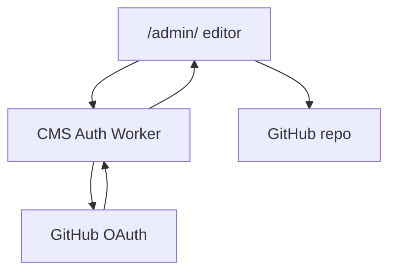

# CMS Auth Worker

Cloudflare Worker OAuth bridge for Decap CMS.

The static site at `https://brentanddenise.com/admin/` cannot safely store a GitHub OAuth client secret in the browser. This Worker handles the secure GitHub OAuth exchange and returns a short-lived GitHub access token to Decap CMS so approved editors can save blog posts and site settings back to `E3RC/brent-and-denise`.

## GitHub OAuth App

Create a GitHub OAuth App under the GitHub account or organization that should own the integration.

- **Application name:** Brent & Denise CMS
- **Homepage URL:** `https://cms-auth.brentanddenise.com`
- **Authorization callback URL:** `https://cms-auth.brentanddenise.com/callback`

Save the generated client ID and client secret.

## Cloudflare Secrets

From this folder, set the required Worker secrets:

```bash
npx wrangler secret put GITHUB_OAUTH_ID
npx wrangler secret put GITHUB_OAUTH_SECRET
```

Use the GitHub OAuth App client ID for `GITHUB_OAUTH_ID` and the generated client secret for `GITHUB_OAUTH_SECRET`.

## Deploy

```bash
npx wrangler deploy
```

The Worker is configured for the custom domain `cms-auth.brentanddenise.com`.

After deploy, visit:

```text
https://cms-auth.brentanddenise.com/
```

You should see a small health-check message. Then test:

```text
https://brentanddenise.com/admin/
```

## How It Fits



Cloudflare Pages continues to host the static public site. This Worker only handles CMS login.
